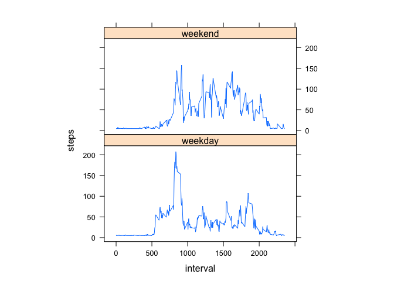

# Reproducible Research: Peer Assessment 1
## Load the librarys for this procject

```r
library('ggplot2')
library(lattice)
```
## Loading and preprocessing the data
Load the csv

```r
activity = read.csv('activity.csv', header = T)
activity$date <- as.Date(activity$date, format="%Y-%m-%d")
activity.stepperday = aggregate(steps ~ date, activity, FUN=sum,na.rm=TRUE)
colnames(activity.stepperday) <- c("Date", "Steps")
ggplot(activity.stepperday, aes(x=Steps)) + 
geom_histogram(fill="steelblue", binwidth=800) + 
labs(title="Histogram of Steps Taken per Day", x="Number of Steps", y="Count") + 
theme_bw() + theme(legend.position = "bottom")    
```

 

## What is mean total number of steps taken per day?

```r
mean(activity.stepperday$Steps)
```

```
## [1] 10766.19
```

## What is median total number of steps taken per day?

```r
median(activity.stepperday$Steps)
```

```
## [1] 10765
```

## What is the average daily activity pattern?

```r
activity.stepsinterval<-aggregate(steps~interval,data=activity,mean,na.rm=TRUE)
colnames(activity.stepsinterval) <- c("Interval", "Steps")
j <- activity.stepsinterval[which.max(activity.stepsinterval$Steps),]$Interval
ggplot(data=activity.stepsinterval, aes(x=Interval, y=Steps)) + geom_line() +
    geom_point() + geom_hline(aes(yintercept=round(max(Steps),1)),color="steelblue") + geom_text(aes( 300, max(Steps), label = paste("Maximum number of steps: ", round(max(Steps),1)), vjust = -1), size = 3,color="steelblue") + geom_vline(xintercept=j,color="green") + 
    geom_text(aes( j+150, 10, label = paste("Interval: ", j)), size = 3,color="green")+ 
theme_bw()    
```

 

## Number of rows with NA's

```r
sum(is.na(activity$steps))
```

```
## [1] 2304
```

## Replacing the NA's with the mean 

```r
teactivity <- activity
teactivity[is.na(teactivity)] <- mean(teactivity$steps, na.rm=T)
activity.stepperdaynna = aggregate(steps ~ date, teactivity, FUN=sum,na.rm=TRUE)

ggplot(activity.stepperdaynna, aes(x=steps)) + 
geom_histogram(fill="steelblue", binwidth=800) + 
labs(title="Histogram of Steps Taken per Day Replacing NA with mean", x="Number of Steps", y="Count") + 
theme_bw() + theme(legend.position = "bottom")    
```

 

### Mean of steps with replaced NA's

```r
mean(activity.stepperdaynna$steps)
```

```
## [1] 10766.19
```

### Median of steps with replaced NA's

```r
median(activity.stepperdaynna$steps)
```

```
## [1] 10766.19
```

### After replacing the mean is equal to the median

```r
mean(activity.stepperdaynna$steps) - median(activity.stepperdaynna$steps)
```

```
## [1] 0
```

## Are there differences in activity patterns between weekdays and weekends?

```r
teactivity$day = ifelse(as.POSIXlt(teactivity$date)$wday%%6 == 
    0, "weekend", "weekday")
teactivity$day = factor(teactivity$day, levels = c("weekday", "weekend"))
activity.stepperdaycompa = aggregate(steps ~ interval + day, teactivity, mean)
xyplot(steps ~ interval | factor(day), data = activity.stepperdaycompa, aspect = 1/2, 
    type = "l")
```

 

